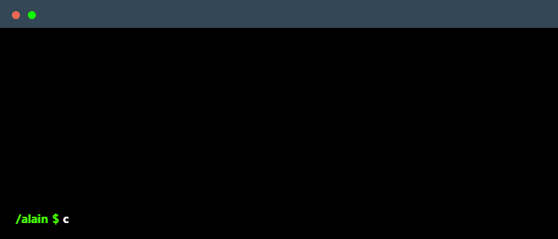

<!--
    Hey there, I'm Ikuzwe Alain Yves Prince!
    Happy to see you here exploring my README code.
    Feel free to inspire!
    
    Feel free to follow and connect on LinkedIn @alain-prince-ikuzwe :)
-->

 

    

### Main skills

### Cybersecurity & Operations Toolkit

### Studying & Specializing

### Publications

 
  

You can find my insights and technical notes on LinkedIn, where I share career milestones, software engineering practices, and hands-on learnings in Application Security (AppSec) and system vulnerabilities.

### Connect with me!

    
    

### Employer?
> [!IMPORTANT]  
> <a href="mailto:alainprinceikuzwe@gmail.com">Contact me via Email</a> or <a href="https://linkedin.com/in/alain-prince-ikuzwe">Reach out on LinkedIn</a>

